# device_systems

API REST desarrollada con **FastAPI** para la gestión del recurso **usuarios** del sistema `device_systems`.

Este repositorio evoluciona a través de varias actividades:

- **EV07** — API inicial: GET y POST, datos en memoria.
- **EV08** — CRUD completo (PUT/PATCH/DELETE), manejo de errores, Dependency Injection.
- **EV09** (actual) — Persistencia real con **SQLAlchemy** y **SQLite**, reemplazando el almacenamiento en memoria.

## Descripción (EV09)

La API ya no guarda los usuarios en una lista: ahora se almacenan, consultan, actualizan y eliminan desde una base de datos SQLite mediante el ORM **SQLAlchemy**.

## Estructura del proyecto

```
device_systems/
├── app/
│   ├── main.py
│   ├── database/
│   │   └── connection.py
│   ├── models/
│   │   └── user_model.py
│   ├── schemas/
│   │   └── user_schema.py
│   ├── routes/
│   │   └── user_routes.py
│   ├── services/
│   │   └── user_service.py
│   └── dependencies/
│       ├── database_dependency.py
│       └── user_dependencies.py
├── requirements.txt
└── README.md
```

## Instalación

```bash
python -m venv venv
source venv/bin/activate   # En Windows: venv\Scripts\activate
pip install -r requirements.txt
```

## Ejecución

Desde la carpeta raíz del proyecto (`device_systems/`):

```bash
uvicorn app.main:app --reload
```

Al iniciar, se crea automáticamente el archivo `device_systems.db` (SQLite) con la tabla `users`, si no existe.

- Swagger UI: `http://127.0.0.1:8000/docs`
- ReDoc: `http://127.0.0.1:8000/redoc`

## Diferencia entre modelo SQLAlchemy y schema Pydantic

Son dos representaciones distintas del mismo concepto ("usuario"), con propósitos diferentes:

- **Modelo SQLAlchemy** (`app/models/user_model.py`, clase `User`): representa la **tabla en la base de datos**. Define columnas, tipos de dato (`Integer`, `String`, `Boolean`, `DateTime`) y restricciones a nivel de base de datos (`nullable=False`, `unique=True`). Es lo que SQLAlchemy usa para generar el SQL y persistir los datos en disco.
- **Schema Pydantic** (`app/schemas/user_schema.py`, clases `UserCreate`, `UserUpdate`, `UserPatch`, `UserResponse`): representa la **forma de los datos que entran y salen por la API HTTP**. Se usa para validar lo que envía el cliente, para documentar Swagger/OpenAPI, y para decidir exactamente qué campos se exponen en la respuesta (por ejemplo, nunca se expone un campo que no exista en el schema, aunque exista en el modelo).

En resumen: el modelo habla con la base de datos; el schema habla con el cliente de la API. Mantenerlos separados permite, por ejemplo, cambiar la base de datos sin tocar los contratos de la API, o exigir campos distintos al crear (`UserCreate`) que al responder (`UserResponse`, que además incluye `id` y `created_at`, generados por el servidor).

## Modelo de datos (tabla `users`)

| Campo      | Tipo     | Restricción                     |
|------------|----------|----------------------------------|
| id         | Integer  | Primary Key                     |
| name       | String   | Obligatorio                     |
| email      | String   | Único y obligatorio             |
| role       | String   | Obligatorio (admin/support/user)|
| is_active  | Boolean  | Valor por defecto `true`        |
| created_at | DateTime | Fecha de creación (automática)  |

## Tabla de endpoints

| Método | Ruta          | Descripción                        | Código éxito   | Errores posibles           |
|--------|---------------|--------------------------------------|----------------|------------------------------|
| GET    | `/users`      | Lista usuarios (filtro + orden)     | 200 OK         | —                            |
| GET    | `/users/{id}` | Consulta un usuario                  | 200 OK         | 404 Not Found                |
| POST   | `/users`      | Crea un usuario                      | 201 Created    | 400 (email duplicado), 422   |
| PUT    | `/users/{id}` | Reemplaza el usuario completo        | 200 OK         | 404, 400 (email duplicado)   |
| PATCH  | `/users/{id}` | Actualiza campos parciales           | 200 OK         | 404, 400 (sin datos/email duplicado) |
| DELETE | `/users/{id}` | Elimina un usuario                   | 204 No Content | 404 Not Found                |

Filtros disponibles en `GET /users`: `?role=`, `?is_active=`, `?order_by=name` o `?order_by=created_at`.

## Ejemplos de peticiones

### Crear usuario

```bash
curl -X POST http://127.0.0.1:8000/users \
  -H "Content-Type: application/json" \
  -d '{"name":"Laura Rojas","email":"laura@sena.edu.co","role":"support","is_active":true}'
```

### Listar usuarios activos ordenados por nombre

```bash
curl "http://127.0.0.1:8000/users?is_active=true&order_by=name"
```

### Actualización parcial

```bash
curl -X PATCH http://127.0.0.1:8000/users/1 \
  -H "Content-Type: application/json" \
  -d '{"role":"support"}'
```

### Eliminar usuario

```bash
curl -i -X DELETE http://127.0.0.1:8000/users/2
```

## Manejo de errores

| Caso                              | Código |
|-----------------------------------|--------|
| Usuario no encontrado             | 404    |
| Correo duplicado                  | 400    |
| PATCH sin campos                  | 400    |
| Rol no permitido / datos inválidos| 422    |

## Cabeceras personalizadas

Toda respuesta incluye:

```
X-App-Name: device_systems
X-API-Version: 3.0.0
```

## Capturas

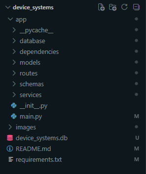

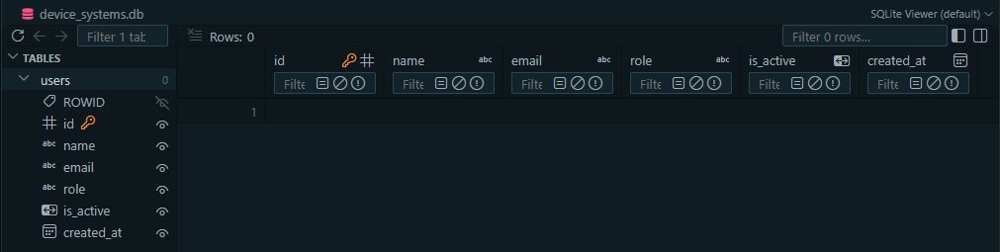

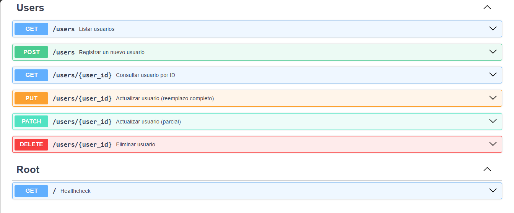

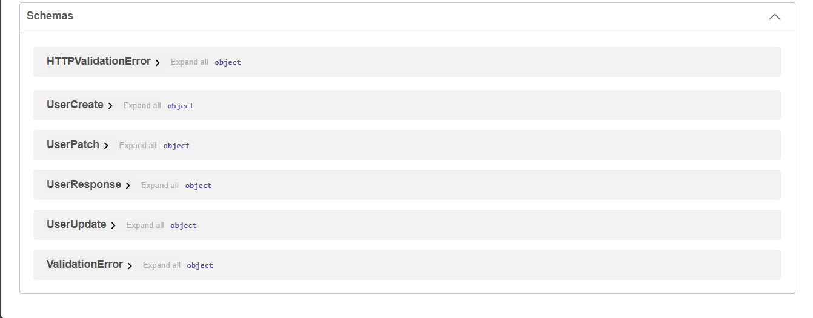

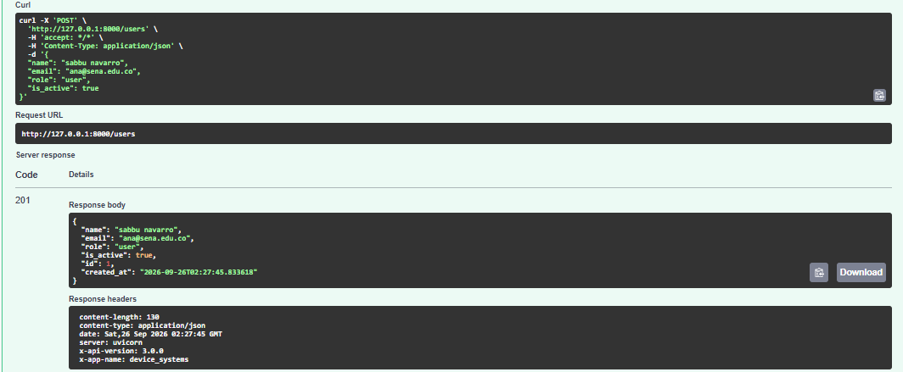

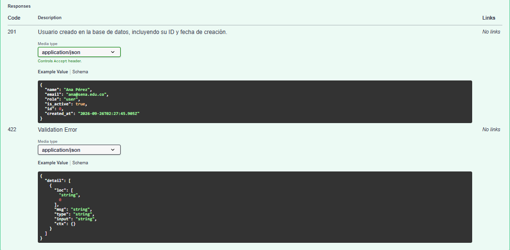

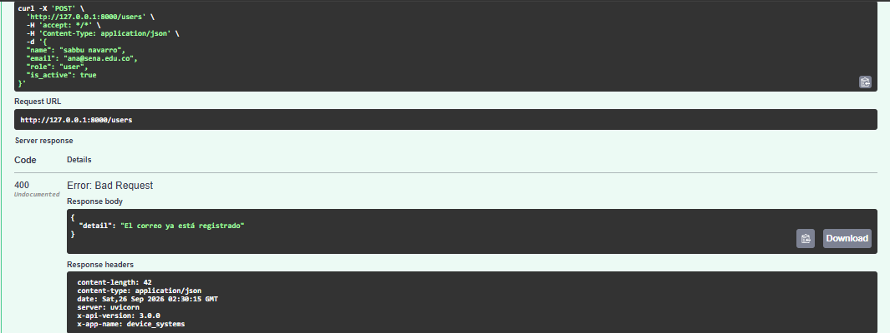

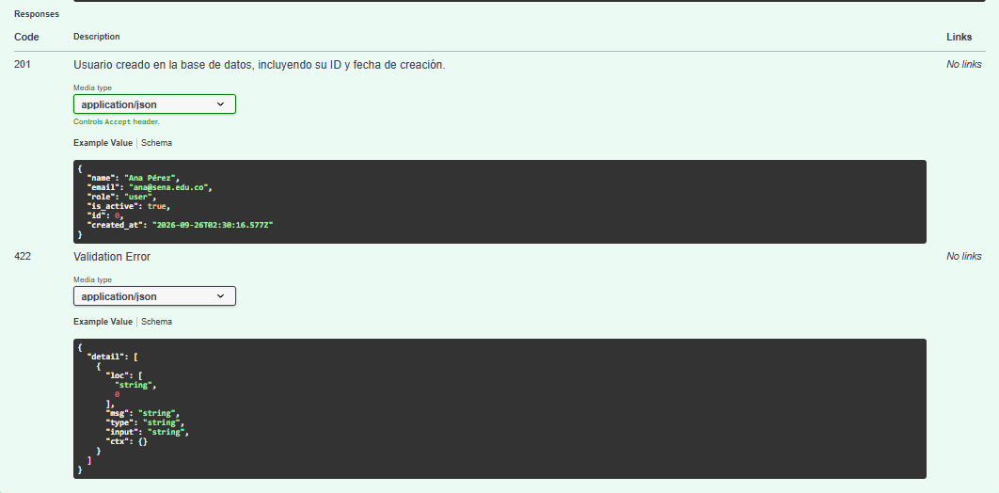

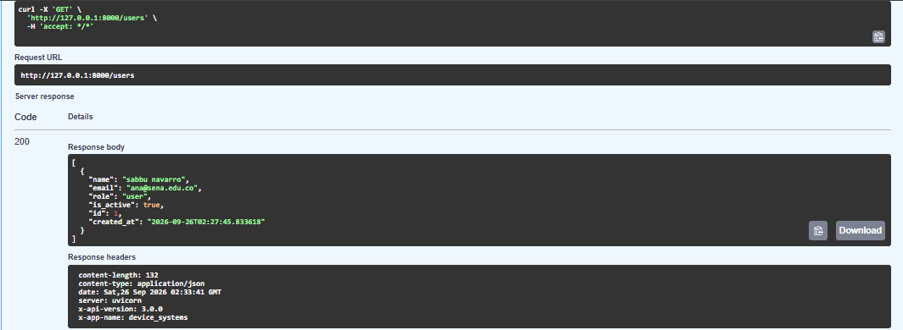

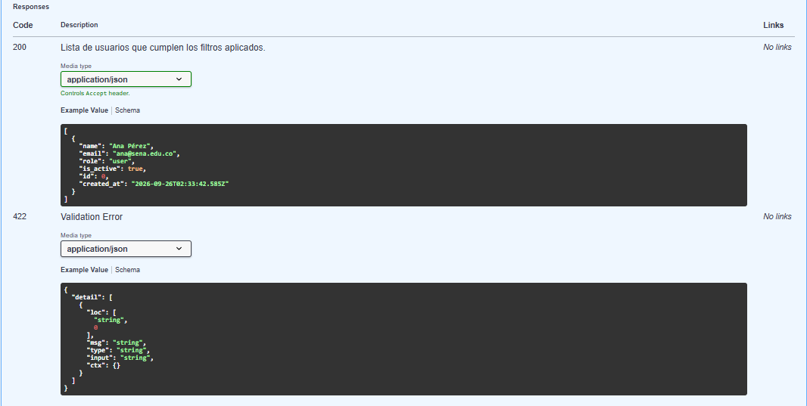

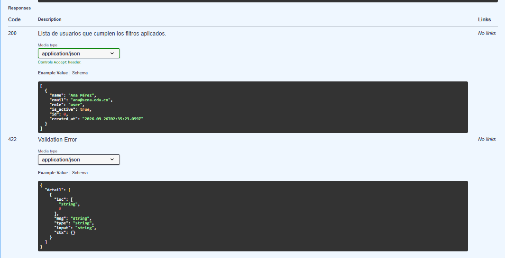

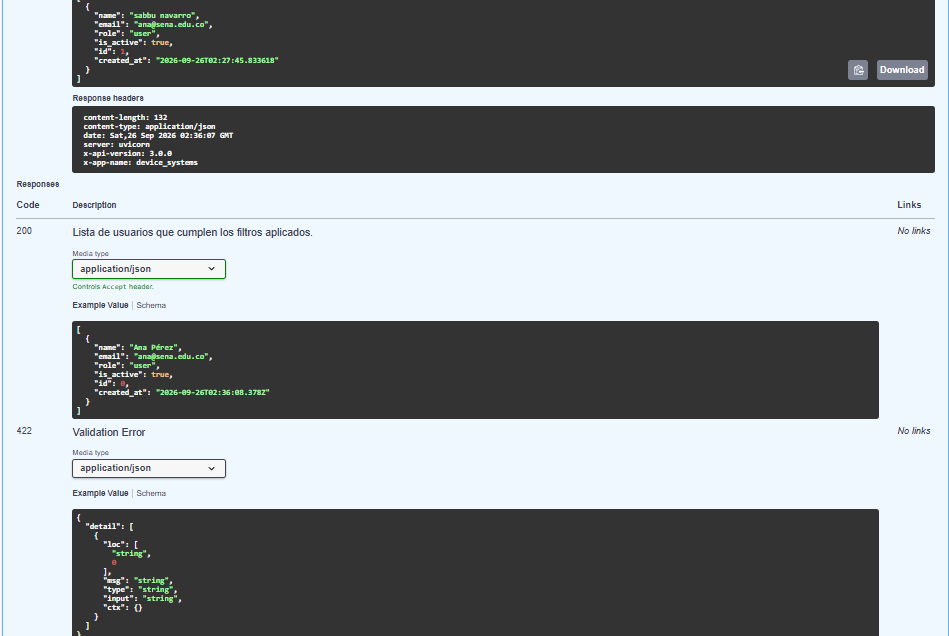

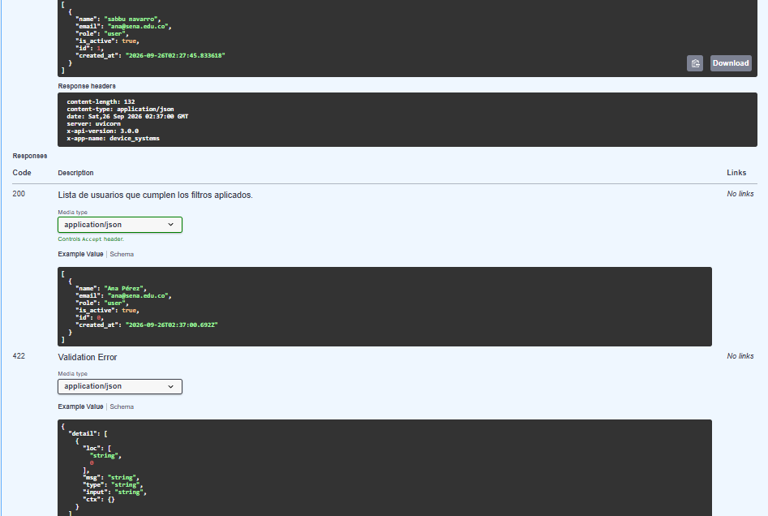

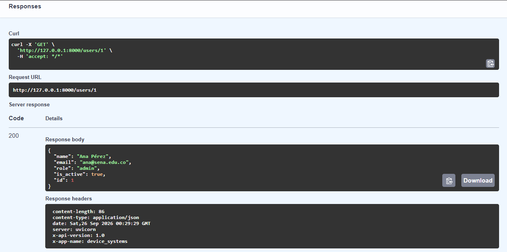

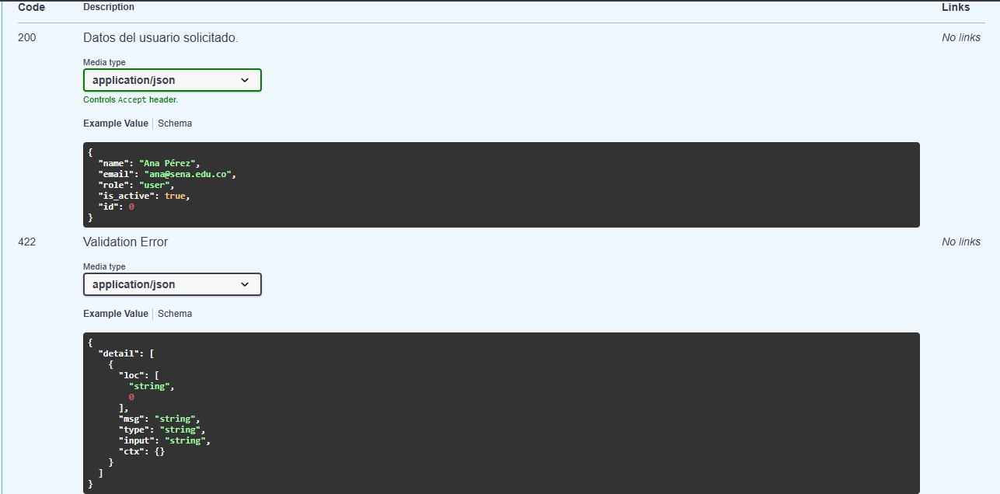

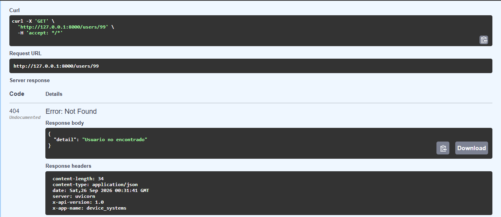

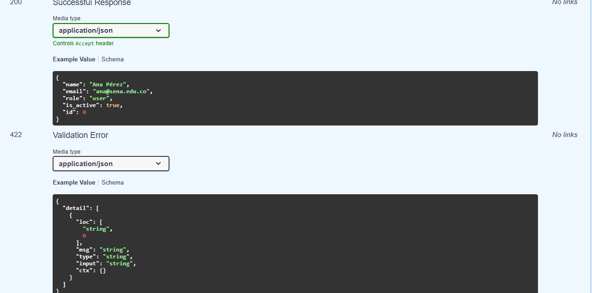


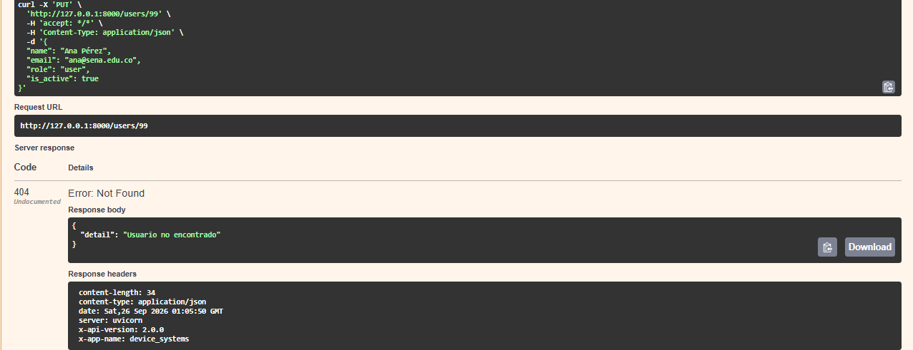

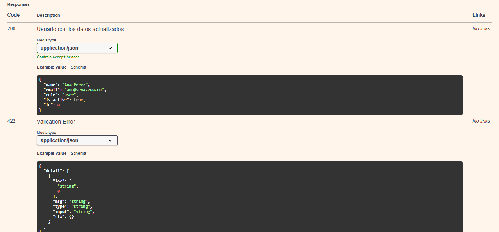

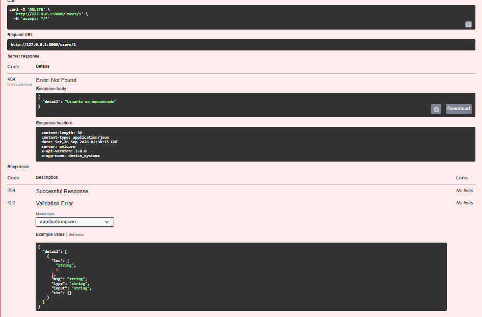

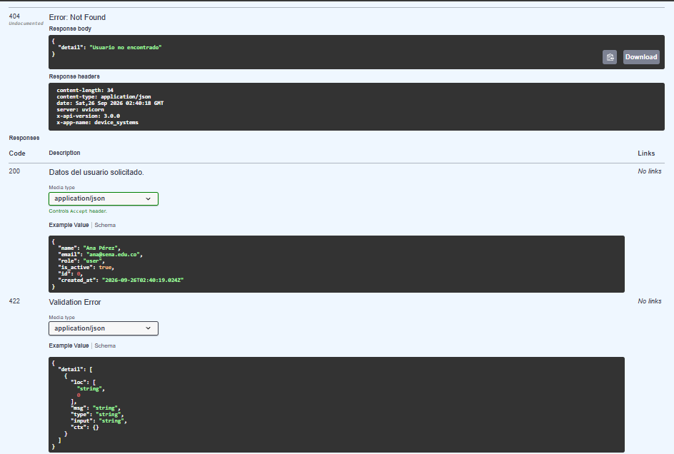

## Reflexión final

_(Pendiente: agregar reflexión personal sobre la importancia de usar persistencia real en una API REST, en comparación con almacenar datos en memoria.)_
