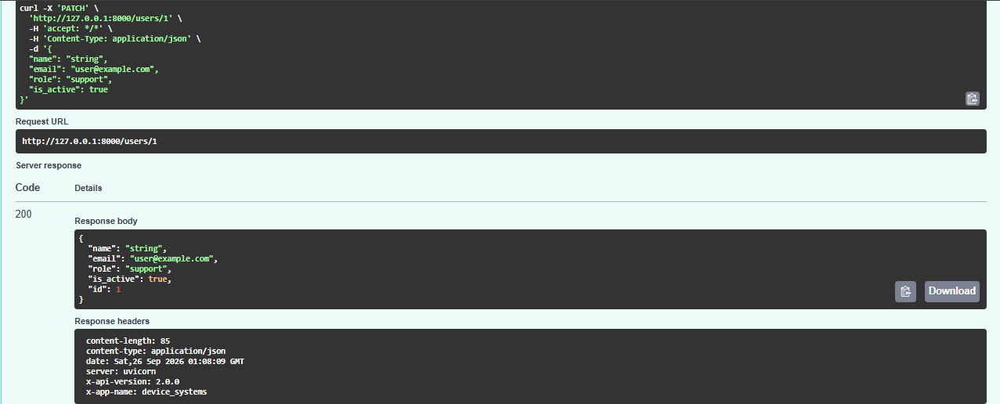
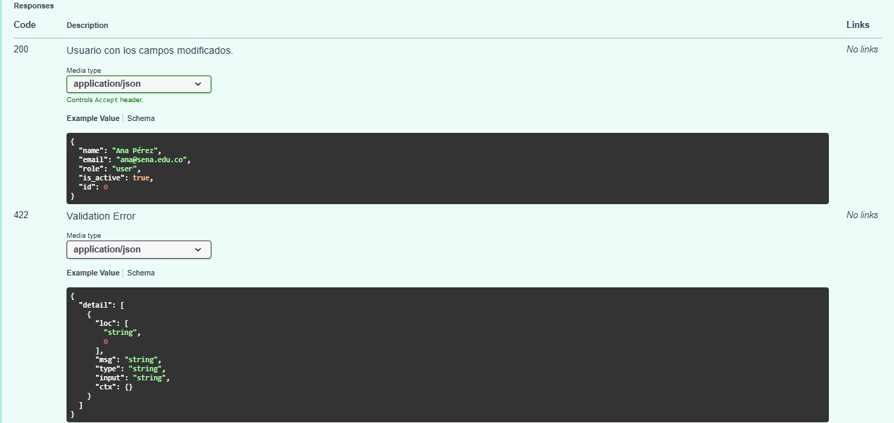
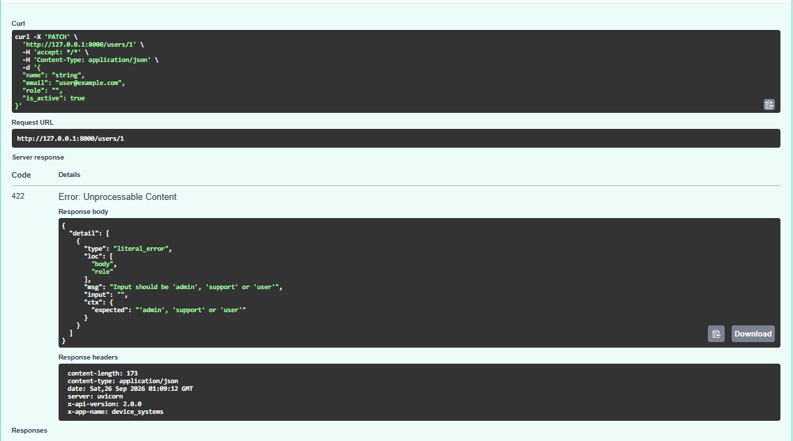
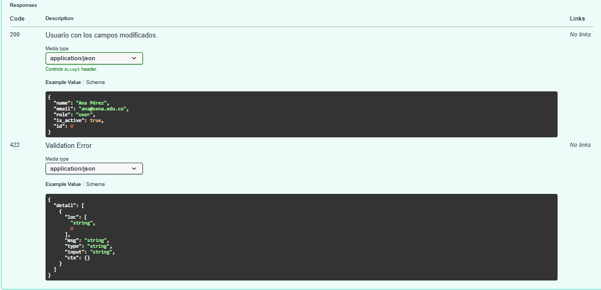
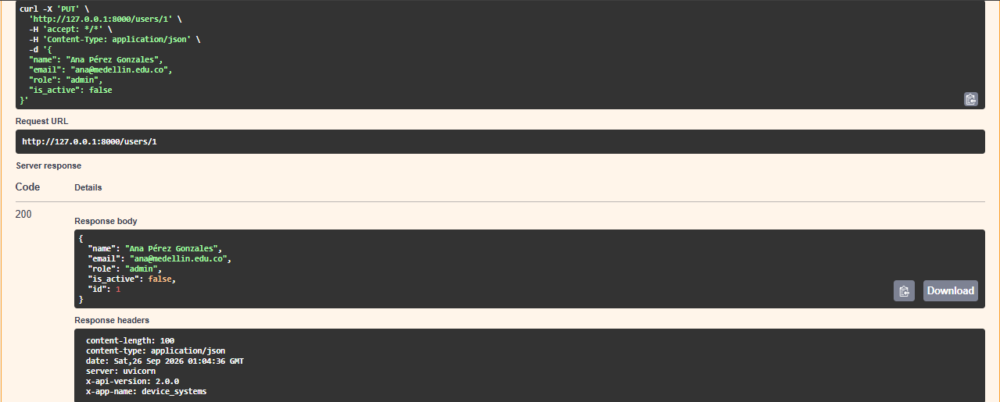
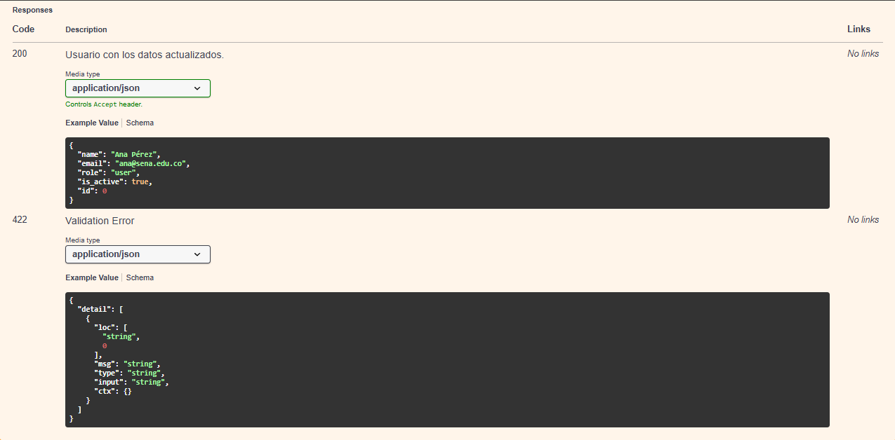
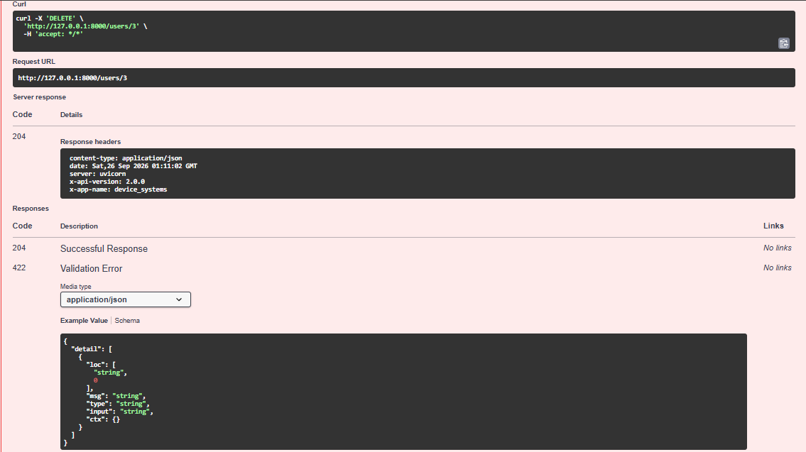
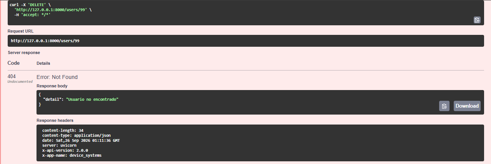
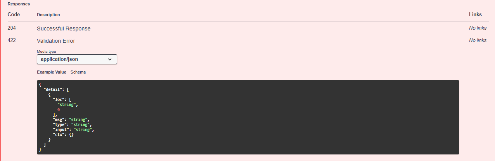

# device_systems

API REST desarrollada con **FastAPI** para la gestión del recurso **usuarios** del sistema `device_systems`.

Este repositorio evoluciona a través de varias actividades:

- **EV07** — API inicial: GET y POST.
- **EV08** (actual) — CRUD completo, manejo de errores, códigos de estado HTTP, Dependency Injection y documentación Swagger/OpenAPI mejorada.

## Descripción (EV08)

En esta versión la aplicación se reorganizó en capas para separar responsabilidades:

- **routes** — definición de endpoints.
- **schemas** — modelos Pydantic de entrada y salida.
- **services** — lógica de negocio.
- **dependencies** — funciones reutilizables con `Depends()`.
- **data** — simulación de base de datos en memoria.

Se agregaron los métodos **PUT**, **PATCH** y **DELETE**, manejo de errores con `HTTPException`, códigos de estado HTTP correctos, y una dependencia `get_user_or_404` que se reutiliza en todas las rutas que operan sobre un usuario existente.

## Estructura del proyecto

```
device_systems/
├── app/
│   ├── main.py
│   ├── routes/
│   │   └── user_routes.py
│   ├── schemas/
│   │   └── user_schema.py
│   ├── services/
│   │   └── user_service.py
│   ├── dependencies/
│   │   └── user_dependencies.py
│   └── data/
│       └── users_db.py
├── requirements.txt
└── README.md
```

## Instalación

```bash
python -m venv venv
source venv/bin/activate   # En Windows: venv\Scripts\activate
pip install -r requirements.txt
```

## Ejecución

Desde la carpeta raíz del proyecto (`device_systems/`):

```bash
uvicorn app.main:app --reload
```

- Swagger UI: `http://127.0.0.1:8000/docs`
- ReDoc: `http://127.0.0.1:8000/redoc`

## Modelo de usuario

| Campo     | Tipo   | Validación                                   |
|-----------|--------|-----------------------------------------------|
| id        | int    | Generado automáticamente                     |
| name      | str    | Obligatorio, mínimo 3 caracteres             |
| email     | str    | Formato de correo válido, único              |
| role      | str    | Uno de: `admin`, `support`, `user`           |
| is_active | bool   | Valor por defecto `true`                     |

## Tabla de endpoints

| Método | Ruta               | Descripción                        | Código éxito | Errores posibles          |
|--------|--------------------|--------------------------------------|--------------|----------------------------|
| GET    | `/users`           | Lista usuarios (filtrable)          | 200 OK       | —                          |
| GET    | `/users/{id}`      | Consulta un usuario                  | 200 OK       | 404 Not Found              |
| POST   | `/users`           | Crea un usuario                      | 201 Created  | 400 (email duplicado), 422 |
| PUT    | `/users/{id}`      | Reemplaza el usuario completo        | 200 OK       | 404, 400 (email duplicado) |
| PATCH  | `/users/{id}`      | Actualiza campos parciales           | 200 OK       | 404, 400 (sin datos o email duplicado) |
| DELETE | `/users/{id}`      | Elimina un usuario                   | 204 No Content | 404 Not Found            |

## Ejemplos de peticiones

### PUT /users/1 (reemplazo completo)

```bash
curl -X PUT http://127.0.0.1:8000/users/1 \
  -H "Content-Type: application/json" \
  -d '{"name":"Ana Pérez G.","email":"ana@sena.edu.co","role":"admin","is_active":true}'
```

### PATCH /users/1 (actualización parcial)

```bash
curl -X PATCH http://127.0.0.1:8000/users/1 \
  -H "Content-Type: application/json" \
  -d '{"role":"support"}'
```

### PATCH vacío (debe fallar con 400)

```bash
curl -X PATCH http://127.0.0.1:8000/users/1 \
  -H "Content-Type: application/json" \
  -d '{}'
```

### DELETE /users/2

```bash
curl -i -X DELETE http://127.0.0.1:8000/users/2
```

Respuesta esperada: `204 No Content` (sin cuerpo).

## Manejo de errores

La API responde con un cuerpo consistente en los errores controlados:

```json
{ "detail": "Usuario no encontrado" }
```

| Caso                              | Código |
|-----------------------------------|--------|
| Usuario no encontrado             | 404    |
| Correo duplicado                  | 400    |
| PATCH sin campos                  | 400    |
| Error de validación (Pydantic)    | 422    |

## Dependency Injection

`app/dependencies/user_dependencies.py` define `get_user_or_404`, usada mediante `Depends()` en `GET /users/{id}`, `PUT`, `PATCH` y `DELETE`, evitando repetir la búsqueda y el manejo del 404 en cada ruta.

## Cabeceras personalizadas

Toda respuesta incluye:

```
X-App-Name: device_systems
X-API-Version: 2.0.0
```

## Capturas de Swagger UI





















## Reflexión

esta actividad nos permite reforzar las solicitudes JSON agregando PUT,PATCH y DELETE, completando el CRUD e investigando más a fondo sobre el manejo de errores, códigos de estado HTTP, Dependency Injection y documentación Swagger/OpenAPI mejorada.
